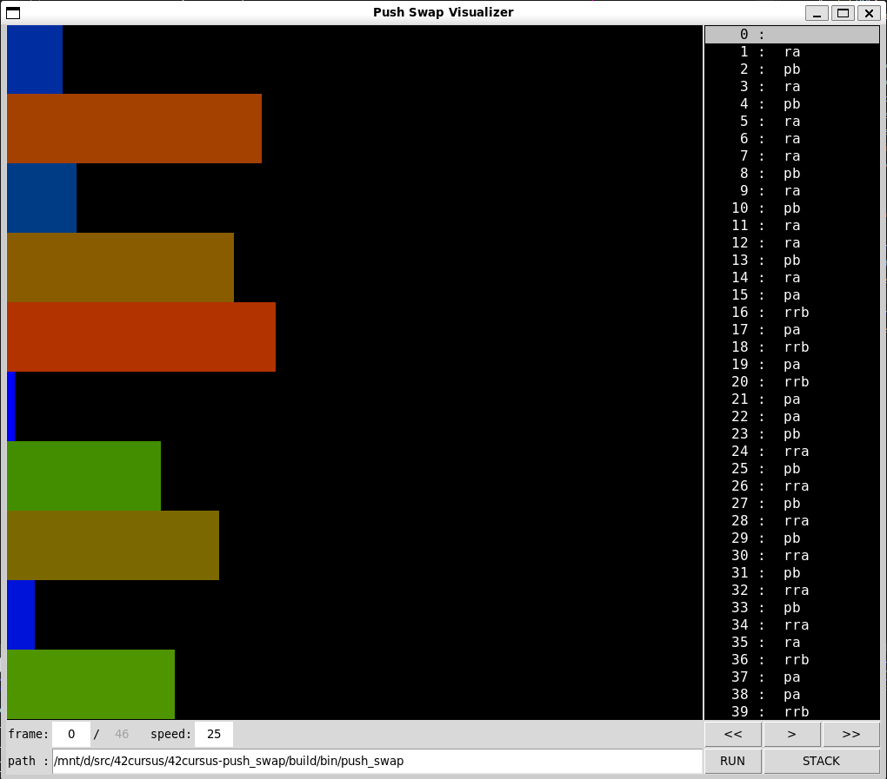
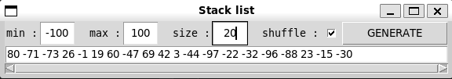
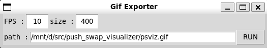

# Push Swap Visualizer

_This project is a fork from orginal https://github.com/o-reo/push_swap_visualizer. So special thank to [o-reo](https://github.com/o-reo) for the project._

This is a python GUI app that helps visualize how the 42 project `push_swap` project works.

> python 3.8 or more version supported !

**Main view**


<!--  -->

**Stack list generator view**


<!--  -->

**Git exporter view**


<!--  -->

**Yeah push_swap in action !**


<!--  -->

## Features

- cli parameters helps to pre-settings app.
- `push_swap` launch timeout setting.
- drawing the stack as a bar graph.
- displays the command list produced by `push_swap`as a list.
- playback speed configuration.
- selection of frame corresponding to a `push_swap` command.
- change path of `push_swap` directly in GUI.
- stack generator.
- GIF exporter

## Installation

Only dev case will be seen.

**macOs install**

```bash
brew install python3
```

**debian-like install**

```bash
sudp apt update
sudo apt install python3 python3-pip python3-venv
```

**make a virtualenv**

Here we use `venv` for install python dépendancies : 

```bash
# create an environnement
python3 -m venv .env

# activate env
source ./.env/bin/activate
```

**Install dependancies**

```bash
pip install -r requirements.txt
```

## Usage

**cli**

About cli arguments, run `python3 push_swap_visualizer.py -h`.

```
usage: push_swap_visualizer.py [-h] [--path PATH] [-t MS] [-s FPS] [--min INT] [--max INT] [--size INT] [INT [INT ...]]

Push Swap Visualizer

positional arguments:
  INT                  your custom stack list

optional arguments:
  -h, --help           show this help message and exit
  --path PATH          'push_swap' path (default: ./push_swap)
  -t MS, --timeout MS  timeout setting to run push_swap (default: 12)
  -s FPS, --speed FPS  frame speed refresh (default: 25)
  --min INT            min value for stack generator (default: 0)
  --max INT            max value for stack generator (default: 100)
  --size INT           size value for stack generator (default: 10)
```

**GUI**

_Main window_

- <kbd>RUN</kbd> : run or re-run `push_swap` with a specific stack.
- <kbd>STACK</kbd> : open stack list window helps to view your stack or generate another.
- <kbd><<</kbd> : got to previous frame. (only in pause mode playback)
- <kbd>></kbd> and <kbd>| |</kbd> : swith app in play or pause mode.
- <kbd>>></kbd> : got to next frame. (only in pause mode playback)
- `frame` : in pause mode, enter the desired frame in frame entry and press <kbd>Enter</kbd>. (not keypad number enter key)
- `speed` : in pause or play mode, enter the desired speed and press <kbd>Enter</kbd>. (not keypad number enter key)

_Stack list window_

- `min` : sets min value wanted in stack.
- `max` : sets max value wanted in stack.
- `size`: sets number of element wanted in stack
- `shuffle`: permits to generate a shuffled stack or not.
- <kbd>GENERATE</kbd> : launch generation of a new stack. (stack generator not run or re-run in `push_swap`, please at this step click in main windows in the <kbd>RUN</kbd>)

_Gif Exporter_

- `FPS` : frame per second speed gif export
- `path` : path to save gif
- <kbd>RUN</kbd> : run and export gif

## TODO

- TODO clean setters.
- SWITCH player as a yield generator
- FIX speed control in playback mode.
- FIX `ValueError` in stack generator.
- ADD `KP_Enter` for speed and frame setting.
- ADD pydocs in all parts.
- ADD setting in cli for gif exporter
- FIX resizing gif

## Credits

- Original forker [xbeheydt](https://github.com/xbeheydt)
- Original writer [o-reo](https://github.com/o-reo)